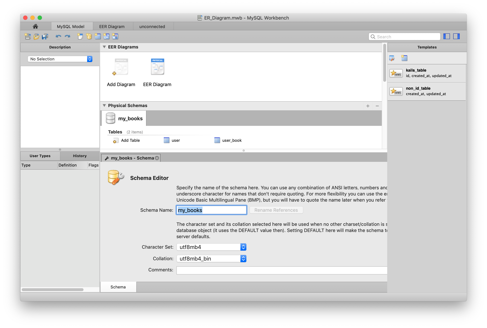
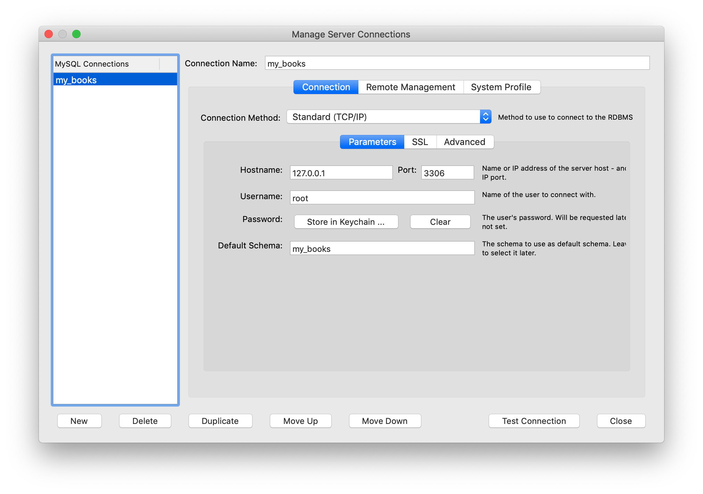
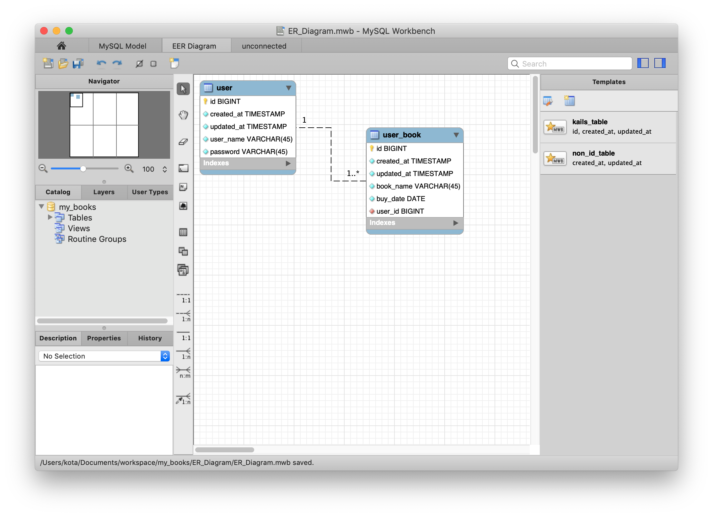
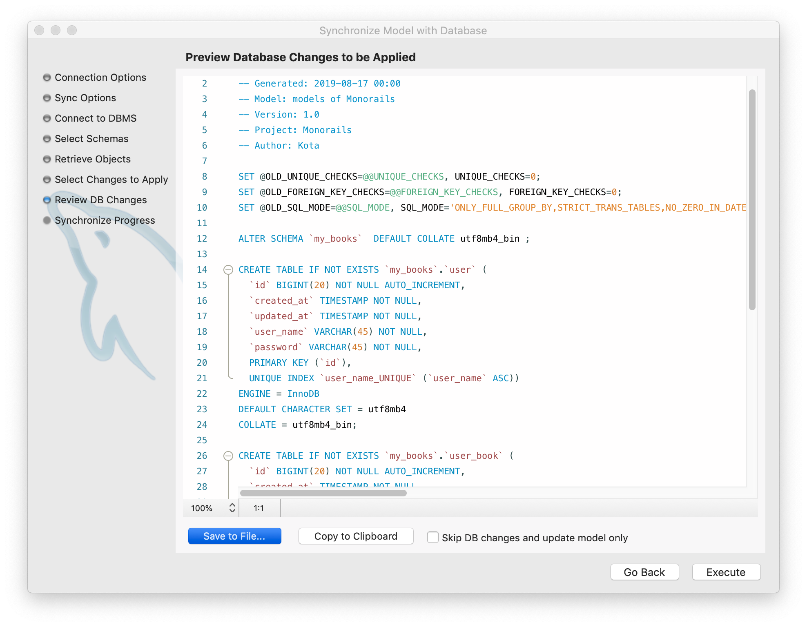

# チュートリアル
ユーザーが自分の本を登録するだけの、my_booksというサービスを作りながら開発プロセスをなぞるチュートリアルです。主な機能、画面は以下とします。パスワードの暗号化など些細な部分は省略します。  
* サインアップ画面
  * ユーザー（名前、ID,パスワード）を登録
* ログイン画面
  * 登録したユーザーでログイン
* マイページ画面
  * 自分の本の一覧を見る
  * 自分の本（名前、購入日）を登録する
* ホーム画面
  * サービスに登録されている全ての本リストを見る画面
  * ユーザー以外も誰でもアクセス可能


## 準備（Macを想定）（MySQLかMariaDB、NodeJSがインストールされていれば省略可能）
（homebrewなどMacを想定していますが、Linuxでもほぼ変わらないので、適宜読み替えて進めること。）
### homebrewのインストール
（コマンドでbrewが実行できるならこの作業は不要です）  
以下を実行します（1行のコマンドです）。
```
ruby -e "$(curl -fsSL https://raw.githubusercontent.com/Homebrew/install/master/install) " 
```
brew の設定とCaskの追加インストール。
```
brew update
brew tap caskroom/cask
brew tap homebrew/cask-versions
```
### MariaDBのインストールと設定
```
brew install mariadb
brew services start mariadb
```
  
データベースの再起動と確認。
```
launchctl stop ~/Library/LaunchAgents/homebrew.mxcl.mariadb.plist
launchctl start ~/Library/LaunchAgents/homebrew.mxcl.mariadb.plist
ps aux | grep mysql
```
  
rootユーザのパスワード初期化。(mysqlでログイン後に実行)。  
<参考>:  https://qiita.com/mighty-n/items/8ec2bd5c140eee83d9b0  
```
set password for root@localhost=password('');
```
```
mysql -u root
(ログイン後)
create database my_books;
exit
```

**mysql -u root で入れることを確認して下さい（exitでMySQLから出ます）。**  

### MySQL Workbenchのインストール
ER図を描くツールとしてMySQL Workbenchを使います。  
https://www.mysql.com/jp/products/workbench/ からインストールしてください。  

### プロジェクトフォルダの準備
erf_devフォルダを`/Users/＜ユーザー名＞/Documents/erf_dev`にコピーし、フォルダ名をプロジェクト名`my_books`に変更します。

### 便利コマンドの準備（省略可）
`~/bin/`をPATHに追加しておきます。ターミナルで`my_books/tools/util-commands/mac`　に移動し、`./install`を実行します。これをするとターミナルで
```
. kails
```
で`my_books/Kails/`に移動できるようになり、
```
. reactapp
```
で`my_books/React_app/`に移動できるようになります。ドットの後ろにはスペースがあります。 

### Node関係の準備
```
brew install yarn
```
で、yarn および NodeJSのインストールをします。

`my_books/Kails/`に移動し、`yarn install`で依存ライブラリをダウンロードします。  
`yarn start`でAPIサーバーが起動します。  
`http://localhost:3000/`を開き確認します。  

`my_books/React_app/`に移動し、`yarn install`で依存ライブラリをダウンロードします。  
`yarn start`でReactGUIサーバーが起動します。  
`http://localhost:3001/`を開き確認します。

**以上で準備は完了です**
***

## ER図によるデータベース設計
`my_books/ER_Diagram/ER_Diagram.mwb`を開く。  
MySQL Modelタブを開く。Physical Schemasの部分でデータベース名が`monoraiels`になっているので
`monorails`の文字をダブルクリックし、Schema Nameを`my_books`に変更する。  
（他はそのまま）  
  
 
DatabaseメニューのManage Connectionを選ぶ。New を押し、名前を`my_books`にする。Default Schemeに`my_books`を入れてOKを押す。  
**（MySQLにmy_booksというデータベースがあることが前提なので作っていなければ  
`create database my_books;`をしてから）**  
  
EER Diagramタブを開く。テーブルを全部削除するが、このとき、「コマンド＋A」で全部選択し、右クリックで「Delete 5 Selected Figure」を選ぶ。単にDeleteキーでは図だけ消えてテーブルモデルは残っている場合がある。

### ユーザーとユーザーブックを作成
右のTemplatesからkails_tableをダブルクリックする。できたテーブルをダブルクリックし、テーブル名を`user`に変更する。Columnに`user_name`と`password`を追加し、２つともNotNullにチェックを入れる。
`user_name`にはUniqueにチェックを入れる。
(単にnameなど簡単なカラム名だと予約語に引っかかる可能性があるので注意。)

もう一度右のTemplatesからkails_tableをダブルクリックする。図上で重ならないように配置し、同じようにテーブル名を`user_book`にして、カラムに`book_name`と`buy_date`を追加する。`buy_date`の型は`DATE`にしておく。

2つの間にリレーションを設定する。左のツールバーから点線の1:nのボタンを押し、user_bookのテーブルを１度クリック、そのまますぐuserテーブルをクリックする。ドラッグアンドドロップではないので独特な操作感だが、難しくはないはず。カーソルが変わるのを確認しながら操作する。（最終的なER図の見た目は以下）
  
（created_atやupdated_atのカラムを下端に持っていくなど自由にやってよい）

### データベースへ反映
DatabaseメニューのSyncronize modelsを選ぶ。Stored Connectionで`my_books`を選ぶ。
ダイアログを進めていくと現在のmy_booksデータベースとの差分SQLが表示される（create tableが２文）。  

  

MySQL Workbenchがいつも正しいSQLを出すわけではない（修正の内容によってはdrop tableを出力することさえある）のでSQLは毎回目視確認する。
SQLが良ければ「Save to File」を押し、`my_books/ER_Diagram/alter_sql/first.sql`へ上書き保存する。その後「Execute」で実行する。
コマンド＋Sを押してER_Diagram.mwbも保存する。
（first.sqlへ保存するのは本番環境を構築する際に必要になるからで、チュートリアルの中ではもう使わない。）

**データベースの構築は以上です**

## KailsによるAPIサーバー構築
`my_books/Kails/package.json`を開き、以下の部分ように修正する。
```
"sequleise:gen": "sequelize-auto -h localhost -d monorails -u root -p 3306  --dialect mysql -o ./app/models/auto_gen -C  -a ./config/sequelize-auto_additional.json",
```
の`monorails`を`my_books`に変える。
```
"sequleise:gen": "sequelize-auto -h localhost -d my_books -u root -p 3306  --dialect mysql -o ./app/models/auto_gen -C  -a ./config/sequelize-auto_additional.json",
```
になる。
```
yarn db:models
```
を実行すると`my_books`に対応した新しいモデルクラスが生成される。

また、Kailsの接続先のデータベースの設定も変更する。
`my_books/Kails/config/database.js`を開き、`monorails`を`my_books`に変える。
```
yarn start
```
を実行し、開発を開始する。 
（NodeJSのコーディング詳細は本ドキュメントの目的から外れるので省略します。写経をしても良いしコピペでも良いです）  

要件を満たすために`/Kails/app/routes/userList.js`を以下のように変更する。  

```Javascript
import Router from 'koa-router';
import userList from '../controllers/user';

const router = Router({
  prefix: '/api'
});

router.post('/user/sign_up', userList.signUp);
router.post('/user/login', userList.login);
router.post('/book/add', userList.addBook);
router.post('/book/list', userList.listBook);

module.exports = router;
```

続いて`/Kails/app/controllers/user/index.js`を以下のように変更する。

```Javascript
import models from '../../models';

export default {

  signUp: async (ctx) => {
    const body = ctx.request.body;
    const userModel = {
      userName: body.userName,
      password: body.password
    };
    const user = await models.user.create(userModel);
    ctx.body = await models.user.findByPk(user.id, {
      include: [{
        model: models.userBook,  // 子テーブルを示す
        required: false          // true で INNER JOIN (false で OUTER JOIN)
      }]
    });
  },

  login: async (ctx) => {
    const body = ctx.request.body;
    const userModel = {
      userName: body.userName,
      password: body.password
    };
    const user = await models.user.findOne({where: userModel});

    if (user) {
      ctx.body = await models.user.findByPk(user.id, {
        include: [{
          model: models.userBook, 
          required: false
        }]
      });
    } else {
      ctx.status = 403;
      ctx.body = 'No match'
    }
  },

  addBook: async (ctx) => {
    const body = ctx.request.body;
    const user = await models.user.findByPk(body.userId);
    const bookModel = {
      userId: user.id,
      bookName: body.bookName,
      buyDate: body.buyDate
    };
    await models.userBook.create(bookModel);

    ctx.body = await models.user.findByPk(body.userId, {
      include: [{
        model: models.userBook, 
        required: false  
      }]
    });
  },

  listBook: async (ctx) => {
    const body = ctx.request.body;
    if (body.userId) {
      ctx.body = await models.user.findByPk(body.userId, {
        include: [{
          model: models.userBook, 
          required: false  
        }]
      });
    } else {
      ctx.body = await models.userBook.findAll();
    }
  }
};
```
必要なルートとその処理を構築しただけです。以後のGUI構築のためにレスポンスの形を多少工夫していますが、非常に簡単なAPIです。RestletクライアントなどHTTPのAPIアクセスを直に行うテストをすれば、コードの期待通り動いていることがわかるはずです。

**APIサーバーの構築は以上です**

## GUIの構築
この規模のアプリをReactJSでルーティングなどもしっかりと作り込むのは手間で、本ドキュメントの目的から外れるので非常に簡易なSPA（ブラウザのリロードで全てがリセットされるような雑な作りのSPA）として作ります。
写経しても良いしコピペでも良いです。  
（余談ですがこのコードを上から1行ずつ写経するのはあまり意味がないかもしれません。なぜならこのコードは上から1行ずつ書いてはいないからです。完成済みのコードを、書いた人と同じ思考を辿ってコーディングするには、少なくとも書いた人と似たような順番でコードを書いていく必要があるでしょう。（APIサーバーの方はさらに小さいコードなので上から1行ずつ辿っても問題ないと思います））

上記で作ったAPIサーバーを動かしたまま、
`my_books/React_app`に移動し、
```
yarn start
```
を実行する。
http://localhost:3001/ をブラウザで開きます。
`React-app/src/App.js`を以下のように変更します。
```Javascript
import React from "react";
import axios from "axios";

class App extends React.Component {
  state = {
    lookMode: false,
    signUpMode: false,
    loginUser: false,
    books: []
  };

  constructor(props) {
    super(props);
    this.userNameRef = React.createRef();
    this.passwordRef = React.createRef();
    this.bookNameRef = React.createRef();
    this.buyDateRef = React.createRef();
  }

  handleSubmitLogin = () => {
    const userName = this.userNameRef.current.value;
    const password = this.passwordRef.current.value;
    this.userNameRef.current.value = '';
    this.passwordRef.current.value = '';
    axios.post("/api/user/login", {userName, password})
      .catch(error => {
        throw error;
      })
      .then((response) => {
        this.setState({loginUser: response.data})
      });
  };

  handleSubmitSignUp = () => {
    const userName = this.userNameRef.current.value;
    const password = this.passwordRef.current.value;
    this.userNameRef.current.value = '';
    this.passwordRef.current.value = '';
    axios.post("/api/user/sign_up", {userName, password})
      .catch(error => {
        throw error;
      })
      .then((response) => {
        this.setState({
          signUpMode: false,
          loginUser: response.data
        })
      });
  };

  handleSubmitAddBook = () => {
    const bookName = this.bookNameRef.current.value;
    const buyDate = this.buyDateRef.current.value;
    this.bookNameRef.current.value = '';
    this.buyDateRef.current.value = '';
    const {loginUser} = this.state;
    axios.post("/api/book/add", {userId: loginUser.id, bookName, buyDate})
      .catch(error => {
        throw error;
      })
      .then((response) => {
        this.setState({loginUser: response.data})
      });
  };

  handleLookMode = () => {
    axios.post("/api/book/list", {})
      .catch(error => {
        throw error;
      })
      .then((response) => {
        this.setState({books: response.data})
      });
    this.setState({lookMode: true});
  };

  handleSignUpMode = () => {
    this.setState({signUpMode: true});
  };

  handleModeOff = () => {
    this.setState({
      lookMode: false,
      signUpMode: false,
      loginUser: false,
      books: []
    });
  };

  render() {
    const {lookMode, signUpMode, books, loginUser} = this.state;

    if (lookMode) {
      return (
        <>
          <h1>MyBooks</h1>
          <a href='javascript:' onClick={this.handleModeOff}>トップへ戻る</a>
          <ul>{books.map((book, idx) => (
            <li key={idx}>
              {book.bookName}
            </li>))}
          </ul>
        </>
      );

    } else if (loginUser) {
      return (
        <>
          <h1>MyBooks</h1>
          <a href='javascript:' onClick={this.handleModeOff}>トップへ戻る</a>
          <div>
            <h3>{loginUser.userName}さんの本棚</h3>
            <ul>{loginUser.userBooks.map((userBook, idx) => (
              <li key={idx}>
                {userBook.bookName}
              </li>))}
            </ul>
          </div>
          <form action='javascript:' onSubmit={this.handleSubmitAddBook}>
            タイトル：<input ref={this.bookNameRef} name='bookName' placeholder='本のタイトル'/><br/>
            購入日：<input ref={this.buyDateRef} name='buyDate' type="date" defaultValue='2019-08-15'/><br/>
            <input type='submit' value='登録'/>
          </form>
        </>
      );

    } else if (signUpMode) {
      return (
        <>
          <h1>MyBooks</h1>
          <a href='javascript:' onClick={this.handleModeOff}>トップへ戻る</a>
          <div style={{height: 16}}/>
          <form action='javascript:' onSubmit={this.handleSubmitSignUp}>
            <input ref={this.userNameRef} name='userName' placeholder='ユーザーID'/><br/>
            <input ref={this.passwordRef} name='password' placeholder='パスワード'/><br/>
            <input type='submit' value='　サインアップ　'/>
          </form>
        </>
      );

    } else {
      return (
        <>
          <h1>MyBooks</h1>
          <form action='javascript:' onSubmit={this.handleSubmitLogin}>
            <input ref={this.userNameRef} name='userName' placeholder='ユーザーID'/><br/>
            <input ref={this.passwordRef} name='password' placeholder='パスワード'/><br/>
            <input type='submit' value='　ログイン　'/> or <a href='javascript:' onClick={this.handleSignUpMode}>サインアップ</a>
          </form>
          <a href='javascript:' onClick={this.handleLookMode}>本の一覧を見る</a>
        </>
      );
    }

  }
}

export default App;
```

画面上のサインアップをクリックし、IDとパスワードを登録、本の名前と登録日を登録する。  
一度トップへ戻って、サインアップしたユーザーでログインすると本が見れる。  
トップへ戻って、本の一覧を見る、をクリックするとログインしないでも本の一覧が見れる。  
UIは非常に簡易ですが、機能は満たしているのが分かるはずです。  

**GUIクライアントの構築は以上です。**

# まとめ
もしサービスに機能を追加する際は、  
ER図に変更を加え、`yarn db:models`を行い、APIサーバーを修正し、GUIクライアントを修正する、  
ということです。気軽に何度でもできることの実感が沸いているでしょうか？