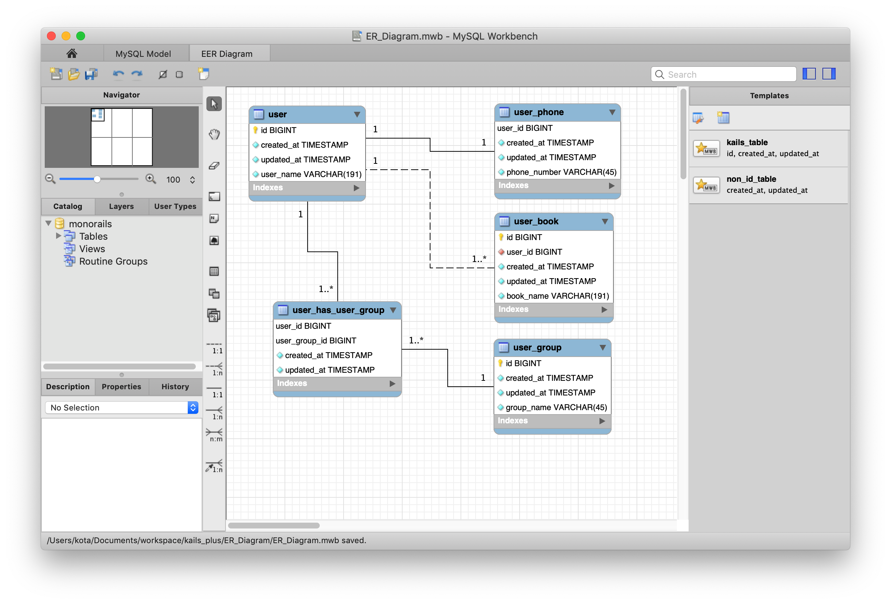

# 【Step1】 ER図を描く
ER図を描くツールとしてMySQL Workbenchを使います。https://www.mysql.com/jp/products/workbench/ からインストールしてください。  


ER_Diagram/ER_Diagram.mwbを開き、サンプルのテーブルを確認したあと、削除して自分のテーブル構成を描きます。
しかし、まずサンプルを動作させるためにはこのテーブル構成のまま読み進めるのが良いでしょう。

## テーブル名、カラム名の制約について
ER_Diagram.mwbでのER図を作成する際の制約について解説します。  
**正しく動作させるためにテーブル名、カラム名の命名規則を守らなければなりません。**  
ER図先行のアプローチでは、ER図はドキュメントでなくアプリケーションコードの一部となるので、正しく作らなければアプリケーションの方にも問題を起こします。自動的にソースコードを生成するために、テーブル名、カラム名を使って判別、処理を行うことから来る制約事項です。
```
「ER図 → ソースコードの自動生成」を担うツールによってはこのような制約は無いこともあります。  
当リポジトリ独自の制約事項と言えます。
```
***
### 1. テーブル名 カラム名 はスネークケース
`user_photo`テーブルの`photo_file_path`カラムや、`book_review`テーブルの`review_contents`カラムのように全て小文字で、アンダースコアで続けた文字列の名称でなければなりません。

### 2. Primary keyは`id`
テーブルにプライマリーキーをつける場合、`id`という名称でなければなりません。(Railsのルール通りです)  
**MysqlWorkbenchのテンプレートを使うことで自動的に作れます。**
### 3. `created_at` , `updated_at` カラムが必須
全てのテーブルには`created_at` , `updated_at` カラムが必要です。(Railsのルール通りです)  
**MysqlWorkbenchのテンプレートを使うことで自動的に作れます。**

### 4. 外部キーは`テーブル名_id`
`user`テーブルを参照する外部キーをつける場合は`user_id`、`user_book`テーブルを参照する外部キーをつける場合は`user_book_id`という名称でなければなりません。  
**MysqlWorkbenchで連携を定義すると自動的にこの命名規則の外部キーになります。**

### 5. Junction tableのテーブル名は`テーブル名_has_テーブル名`
`user`テーブルと`user_group`が多対多の関係であり、中間のテーブルを作る場合、`user_has_user_group`というテーブル名でなければなりません。  
（これは必須ではありませんが、そうするとsequelizeで多対多の関係を扱えるようになるので便利です）
**MysqlWorkbenchで多対多の連携を定義すると自動的にこの命名規則のテーブルが作られます。**  
**ただし`created_at`, `updated_at`カラムは定義されないので手作業で追加することが必要です。**　　
***
つまり、命名を少し注意すること、多対多の連携を定義した時に`created_at`, `updated_at`カラムを手作業で追加することの２つだけに気を払っていれば問題なく使えます。  
MySQL Workbenchの初期状態ではありませんが、ER_Diagram/ER_Diagram.mwbは上記の設定を済ませて保存したファイルです。
```
これらは余計な手間に感じるかもしれませんが、MySqlWorkbenchがもう少しだけカスタマイズできれば、あるいは別のER
図作成ツールを使うことで改善できるかもしれません。現時点ではベストなツールだと思うのでMySqlWorkbenchを使いまし
た。
```

## ER図作成後の作業
このER図（mwbファイル）から直接ソースコードは生成できません。一度MySQLにテーブルを構築し、そのテーブル構成からソースコードを生成する、という手順になります。

MySQL Workbenchのメニューから「Database」→「Syncronize Model...」を選びます。ダイアログが開き、現状のデータベースからのAlter文が生成されるので`ER_Diagram/alter_sql/`フォルダに保存してから実行します。ダイアログをどんどん進めるとAlter文の保存をしないで実行し、ダイアログが閉じてしまうので注意してください。

念の為補足しておくと、データベースが空っぽの状態なら全てのCreate table文が含まれたSQLとなります。このSQLでデータベースを作り本番運用を開始した後で、サービスのアップデートが必要になったとします。その場合はER図の修正をし、再度ダイアログによってAlter文を生成し、それを運用中のデータベースに適応します。アプリケーションもデータベースの修正に合わせて修正し、本番運用中のモジュールと入れ替えることでサービスのアップデートができます。
```
SQLを確実に確認してから本番のデータベースに適応するため、モデルソースコードから自動的にデータベースのマイグレー
ションを行う、というマイグレーション処理は採用していません。そのマイグレーション処理を組み込むこともできるはずで
あり、この辺りの開発手順は開発責任者の好みでカスタマイズして良いでしょう。
```
[＞ ER図、データベースの準備ができたら次に進みましょう。](./Kails.md)  
[＞ Topに戻る](../README.md)